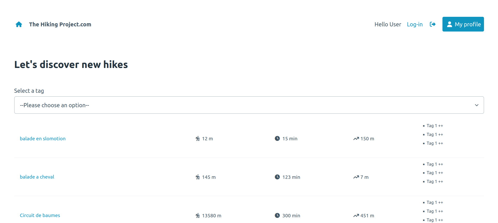

# The Hiking Project.com

## About the Project
The Hiking Project is a small web application created during training at becode.org. The project runs in a Docker container and was developed as a group effort. It serves as a social network centered around hiking. The design is primarily based on [picocss](https://picocss.com/) with a few minor additions.

## Features
- Publish your hikes
- View hikes from other users
- Delete and edit your hikes
- Filter hikes by tags

## Used Technologies
- Docker
- PHP
- MySQL

## Contributors
- [Corentin Nys](https://github.com/corentinnys)
- [Rui Filipe](https://github.com/ruisinhofilipe)
- [Camille Marchandon](https://github.com/CMarchandon)

## Mockup
[To be defined]

## About the docker and the template used

### What is this ?
This template repository is a boilerplate setup for a PHP application.
Its current version ships with PHP 8.1, Mysql 8.0, phpMyAdmin and an Nginx server running on Alpine.
All of it orchestrated and run by Docker Compose.

### Requirements
Docker Engine and Docker Compose

### How to use it ?
Clone this repository, or click the _Use this template_ button on Github.
For more information about Github repositories, please refer to the [Github documentation](https://docs.github.com/en/repositories/creating-and-managing-repositories/creating-a-repository-from-a-template).

Once cloned, please refer to the README.md file provided by phpdocker.io in the phpdocker directory to run the application.

The entrypoint of your php application will be _/src/public/index.php_.

### Notes
The Docker Compose file was _initially_ generated by [phpdocker.io](https://phpdocker.io/).
